# L'Escape Game Odyssée

Ramener Ulysse à Ithaque !

## Solution des énigmes

Si vous lisez ces lignes, c'est que vous êtes soit désespéré de trouver la solution, soit un tricheur. Il n'y a rien de très compliqué, alors tentez quand même avant de regarder la solution !

### Le rameur Géodésique

Rien de bien compliqué, il se trouve au nord de l'île d'Oléron. 
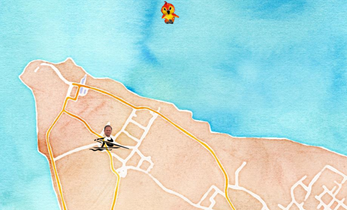.

### La croix du Panthéon

Des difficultés pour trouver le point fondamental de la NTF ? Pourtant Coco vous dit d'aller chercher la Croix du Panthéon.  
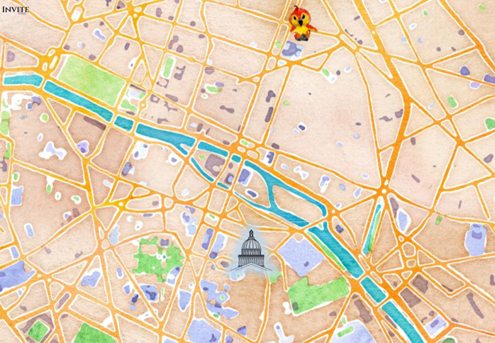.

### Le bureau de Patricia

Il se trouve à l'ENSG, donc à Champs-sur-Marne. Zoomé bien sur l'ENSG pour voir Patricia !
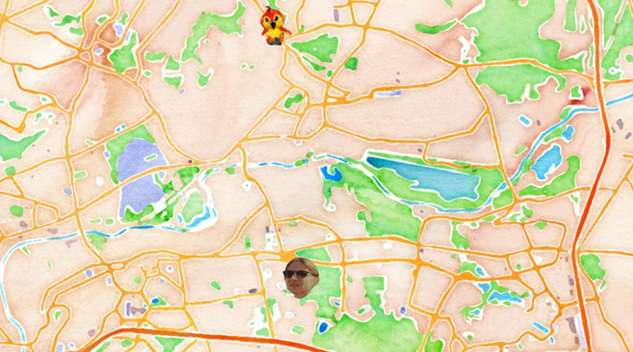.

### Le kangoo

Envie de faire un tour en kangoo ? Retrouvez le sur Oléron et entrez simplement le code chauffeur : _1geo2geo3geometre_
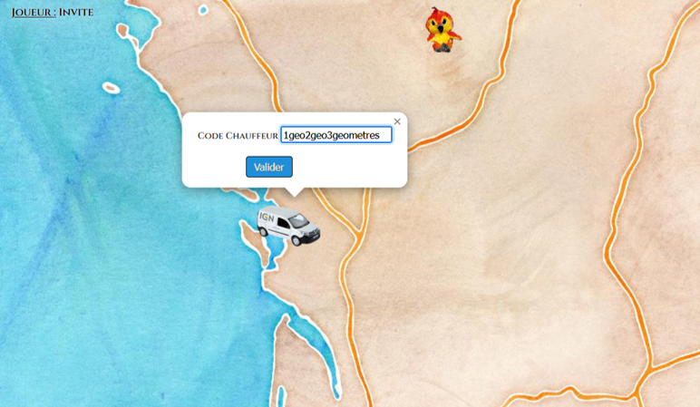.

### Le Port de Marseille

Glisser le kangoo jusqu'au Vieux Port de Marseille, et déposez le dans le carré rouge. Puis cliquez sur _prendre la mer_
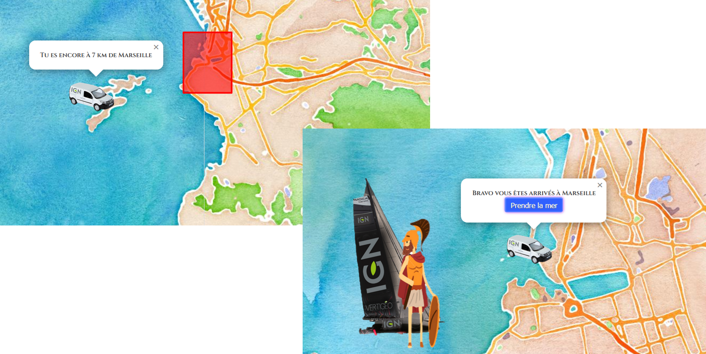.

### Echouer sur les Canaries et trouver Hervé

Manque de chance, vous échoué sur les Canaries. Le diagramme UML est important, cliquez dessus pour le récupérer, puis allez voir Hervé. Pas besoin de chercher loin, il n'est qu'à quelques kilomètres au nord-ouest, sur le Teide. Hervé vous donne les coordonnées d'Ithaque, que vous devez entrer dans le formulaire. Si vous suivez les instructions à la lettre, entrez les comme données et continez l'aventure. Mais si votre talent de géographe est en alerte, remettez les coordonnées dans le bon sens, ça vous évitera les détours...
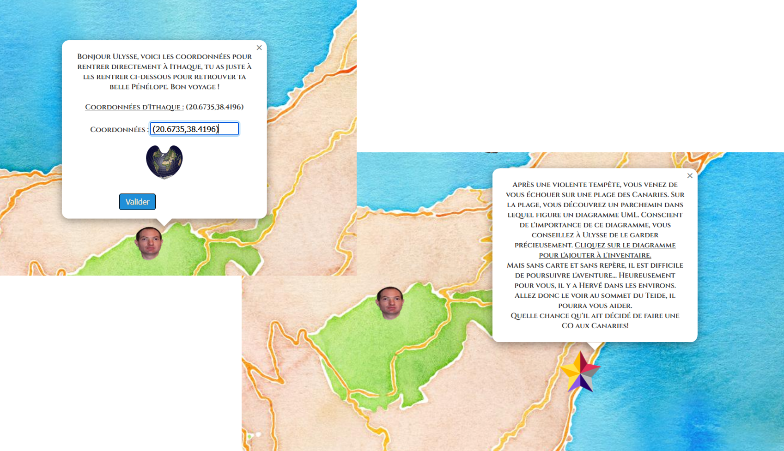.

### Le dieu du réseau

Malheuresement, vous atterissez dans la mer rouge, mais cliquez donc sur Xavier. Il vous file un coupe de main en vous disant d'aller voir le dieu du réseau. Il se trouve juste à côté. Cliquez dessus pour qu'il vous dise d'aller voir Fritsch à Alexandrie.
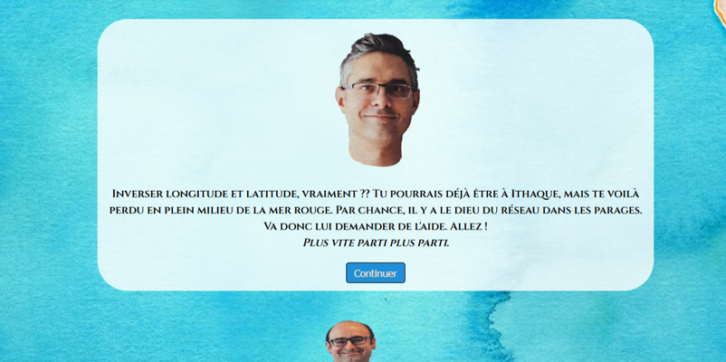.

### Le dieu de la doc

Retrouvez donc Fritsch à Alexandrie, au bord de la Méditerranée. Celui-ci vous demande d'aller chercher une commande dans la doc, tout en bas de la page _VACUUM ANALYZE_
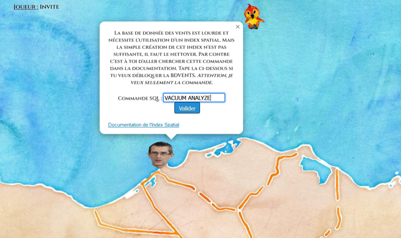.

### L'île de Malika

Bienvenu sur l'île de Malika. Victor apparaît pour vous prévénir, alors écoutez le. Pour quitter cet endroit, utilisez le diagramme UML en cliquant dessus depuis l'inventaire.
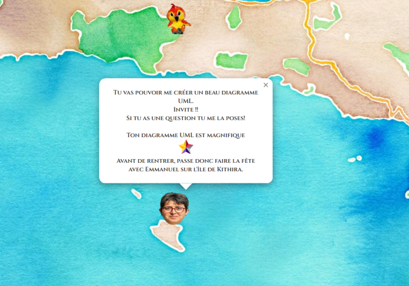.

### L'île de Clédat

Retrouvez donc Clédat sur l'île de Cythère, entre la Crète et la Grèce. 
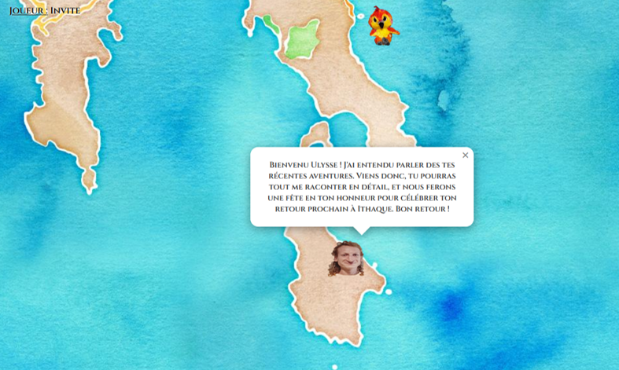.

### Le retour 

Revenu à Ithaque et accueilli par Pénélope, il est temps de finir l'aventure. Appuyez sur terminer pour entrer au hall of fame.
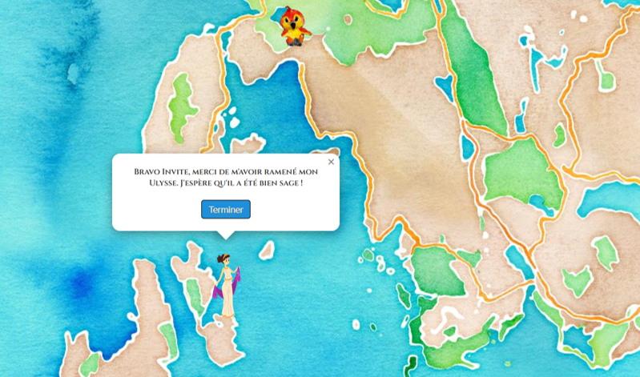.
